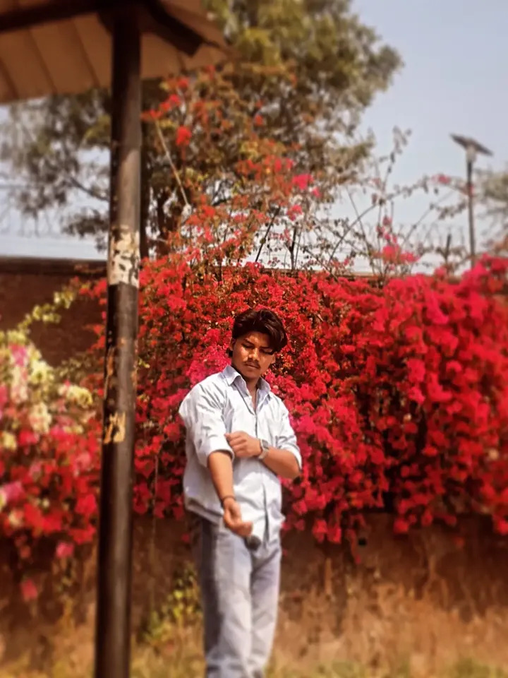

birthday deep💕

<!DOCTYPE html>
<html>
<head>
  <title>Happy Birthday Deepuuu 💖</title>
  
</head>
<body>

  <h1>🎂 Happy Birthday Deepuuu 💖</h1>
  

    Deepak, 
    Sach bolu… main tumhare saath bahut khush rehti hoon. 
    Tumhari smile mujhe itni achchi lagti hai ki mood instantly better ho jata hai. 
    Tumhara gaana sunna… woh alag hi feeling deta hai. 
    Kabhi kabhi tumhari yaad bhi aati hai… kaafi zyada. 
    Bas aise hi hamesha smile karte rehna. 
    💖
  

  <!-- Slideshow -->
  

  <!-- Audio -->
  <audio autoplay loop controls>
    <source src="song.mp3" type="audio/mpeg">
  </audio>

</body>
</html>
